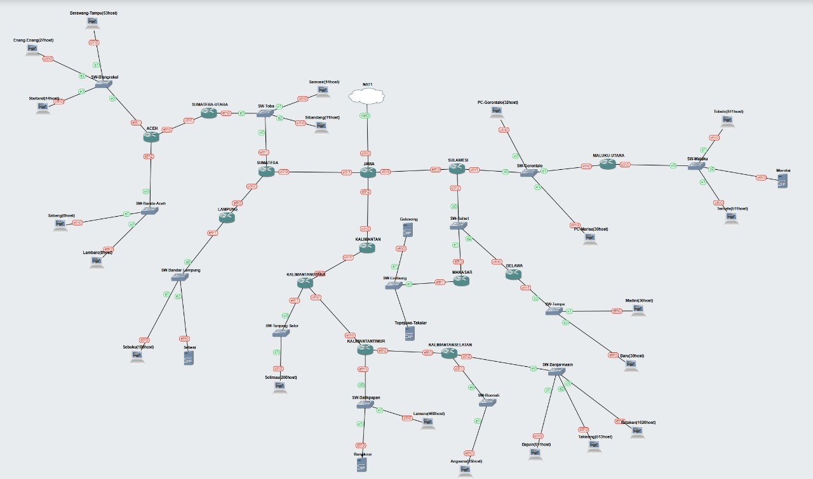
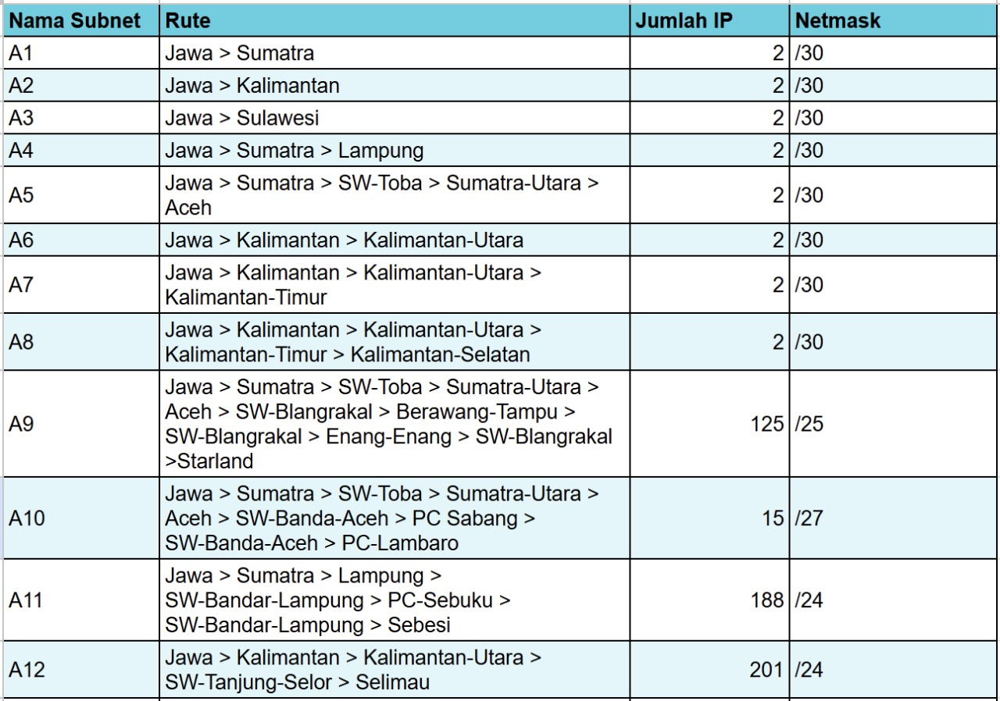
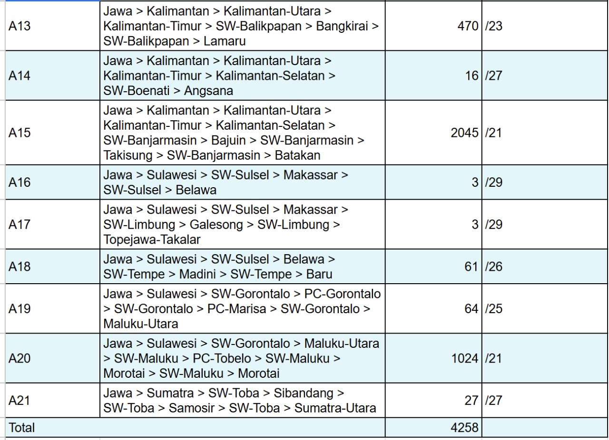
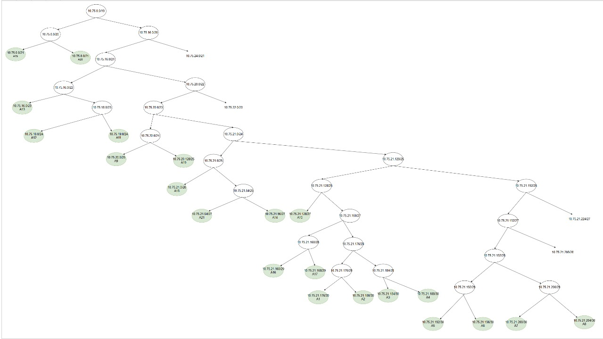
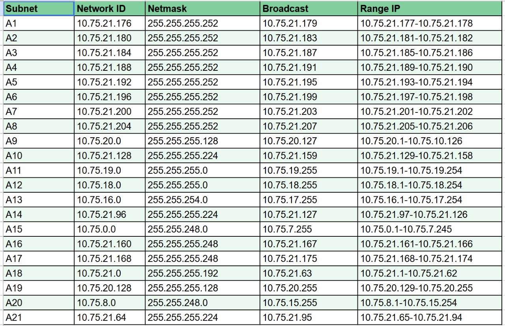

# Jarkom-Modul-4-IT23-2024
**Praktikum Jaringan Komputer Modul 4 Tahun 2024**

# Laporan Resmi
| Nama | NRP |
| ---- | ---- |
| Etha Felisya Br Purba | 5027221017 |
| Rahmad Aji Wicaksono | 5027221034 |

## Daftar Isi
1. [Laporan Resmi](#Laporan-Resmi)
2. [Daftar Isi](#Daftar-Isi)
3. [Topologi](#Topologi)
4. [Rute Subnet](#Rute-Subnet)
5. [VLSM](#VLSM)
6. [CIDR](#CIDR)

## Topologi
### GNS3 | VLSM |
 
 
### Cisco Packet Tracer | CIDR |
  
 
## Rute Subnet
 
 

 ## VLSM
 ### Tree VLSM
 Berikut adalah Tree yang digunakan sebagai visualisasi VLSM
  

### Pembagian IP VLSM
Berikut adalah pembagian IP pada VLSM
 

### Konfigurasi GNS3
- JAWA
```
auto eth0
iface eth0 inet dhcp

auto lo
iface lo inet loopback

# ke Sumatera
auto eth1
iface eth1 inet static
	address 10.75.21.177
	netmask 255.255.255.252

# ke Kalimantan
auto eth2
iface eth2 inet static
	address 10.75.21.181
	netmask 255.255.255.252

# ke Sulawesi
auto eth3
iface eth3 inet static
	address 10.75.21.185
	netmask 255.255.255.252
```
- SUMATERA
```
auto lo
iface lo inet loopback

# ke jawa
auto eth0
iface eth0 inet static
	address 10.75.21.178
	netmask 255.255.255.252
	gateway 10.75.21.177
    
# ke samosir,sibandang,sumatera-utara
auto eth1
iface eth1 inet static
	address 10.75.21.65
	netmask 255.255.255.224

# ke lampung
auto eth2
iface eth2 inet static 
    address 10.75.21.189
    netmask 255.255.255.252
```
- SAMOSIR,SIBANDANG
```
# ke sumatera
auto eth0
iface eth0 inet static
	address 10.75.21.66
	netmask 255.255.255.224
	gateway 10.75.21.65
```
- SUMATERA-UTARA
```
auto lo
iface lo inet loopback

# ke sumatera
auto eth0
iface eth0 inet static
	address 10.75.21.66
	netmask 255.255.255.224
	gateway 10.75.21.65

# ke aceh 
auto eth1
iface eth1 inet static
	address 10.75.21.193
	netmask 255.255.255.252
```
- ACEH
```
auto lo
iface lo inet loopback

# ke sumatera-utara
auto eth0
iface eth0 inet static
	address 10.75.21.194
	netmask 255.255.255.252
	gateway 10.75.21.193

# ke berawang,enang,starland
auto eth1
iface eth1 inet static
	address 10.75.20.1
	netmask 255.255.255.128

# ke sabang,lambaro
auto eth2
iface eth2 inet static 
    address 10.75.21.129
    netmask 255.255.255.224

```
- BERAWANG,ENANG,STARLAND
```
# ke ACEH
auto eth0
iface eth0 inet static
	address 10.75.20.2
	netmask 255.255.255.128
	gateway 10.75.20.1
```
- SABANG,LAMBARO
```
# ke ACEH
auto eth0
iface eth0 inet static
	address 10.75.21.130
	netmask 255.255.255.224
	gateway 10.75.21.129
```
- LAMPUNG
```
auto lo
iface lo inet loopback

# ke sumatera
auto eth0
iface eth0 inet static
	address 10.75.21.190
	netmask 255.255.255.252
	gateway 10.75.21.189

# ke sebuku,sebesi
auto eth1
iface eth1 inet static
	address 10.75.19.1
	netmask 255.255.255.0
```
- SEBUKU,SEBESI
```
# ke lampung
auto eth0
iface eth0 inet static
	address 10.75.19.2
	netmask 255.255.255.0
	gateway 10.75.19.1
```
- KALIMANTAN
```
auto lo
iface lo inet loopback

# ke jawa
auto eth0
iface eth0 inet static
	address 10.75.21.182
	netmask 255.255.255.252
	gateway 10.75.21.181

# kalimantan-utara
auto eth1
iface eth1 inet static
	address 10.75.21.197
	netmask 255.255.255.252
```
- KALIMANTAN-UTARA
```
auto lo
iface lo inet loopback

# ke kalimantan
auto eth0
iface eth0 inet static
	address 10.75.21.198
	netmask 255.255.255.252
	gateway 10.75.21.197

# ke selimau
auto eth1
iface eth1 inet static
	address 10.75.18.1
	netmask 255.255.255.0

# ke kalimantan-timur
auto eth2
iface eth2 inet static
	address 10.75.21.201
	netmask 255.255.255.252
```
- SELIMAU
```
# ke kalimantan-utara
auto eth0
iface eth0 inet static
	address 10.75.18.2
	netmask 255.255.255.0
	gateway 10.75.18.1
```
- KALIMANTAN-TIMUR
```
auto lo
iface lo inet loopback

# ke kalimantan-utara
auto eth0
iface eth0 inet static
	address 10.75.21.202
	netmask 255.255.255.252
	gateway 10.75.21.201

# ke bangkirai,lamaru
auto eth1
iface eth1 inet static
	address 10.75.16.1
	netmask 255.255.254.0

# ke kalimantan-selatan
auto eth2
iface eth2 inet static
	address 10.75.21.205
	netmask 255.255.255.252
```
- BANGKIRAI,LAMARU
```
# ke kalimantan-utara
auto eth0
iface eth0 inet static
	address 10.75.16.2
	netmask 255.255.254.0
	gateway 10.75.16.1
```
- KALIMANTAN-SELATAN
```
auto lo
iface lo inet loopback

# ke kalimantan-timur
auto eth0
iface eth0 inet static
	address 10.75.21.206
	netmask 255.255.255.252
	gateway 10.75.21.205

# ke angsana
auto eth1
iface eth1 inet static
	address 10.75.21.97
	netmask 255.255.255.224

# ke bajuin,takisang,batakan
auto eth2
iface eth2 inet static
	address 10.75.0.1
	netmask 255.255.248.0
```
- ANGSANA
```
auto eth0
iface eth0 inet static
	address 10.75.21.98
	netmask 255.255.255.224
	gateway 10.75.21.97


#BAJUIN,TAKISANG,BATAKAN.
auto eth0
iface eth0 inet static
	address 10.75.0.2
	netmask 255.255.248.0
	gateway 10.75.0.1
```
- SULAWESI
```
auto lo
iface lo inet loopback

# ke jawa
auto eth0
iface eth0 inet static
	address 10.75.21.186
	netmask 255.255.255.252
	gateway 10.75.21.185

# ke gorontalo,marisa,maluku-utara
auto eth1
iface eth1 inet static
	address 10.75.20.129
	netmask 255.255.255.128

# ke makasar,belawa
auto eth2
iface eth2 inet static
	address 10.75.21.161
	netmask 255.255.255.248
```
- GORONTALO,MARISA
```
# ke sulawesi
auto eth0
iface eth0 inet static
	address 10.75.20.130
	netmask 255.255.255.128
	gateway 10.75.20.129
```
- MALUKU-UTARA
```
auto eth0
iface eth0 inet static
	address 10.75.20.130
	netmask 255.255.255.128
	gateway 10.75.20.129

#ke tobelo,morotai,ternate
auto eth1
iface eth1 inet static
	address 10.75.8.1
	netmask 255.255.248.0


#TOBELO,MOROTAI,TERNATE.
#ke maluku-utara
auto eth0
iface eth0 inet static
	address 10.75.8.2
	netmask 255.255.248.0
	gateway 10.75.8.1
```
- MAKASAR
```
auto lo
iface lo inet loopback

#ke Sulawesi
auto eth0
iface eth0 inet static
	address 10.75.21.162
	netmask 255.255.255.248
	gateway 10.75.21.161

# ke galesong,topejawa
auto eth1
iface eth1 inet static
	address 10.75.21.169
	netmask 255.255.255.248
```
- GALESONG
```
#ke makasar
auto eth0
iface eth0 inet static
	address 10.75.21.170
	netmask 255.255.255.248
	gateway 10.75.21.169


#BELAWA
auto lo
iface lo inet loopback

#ke Sulawesi
auto eth0
iface eth0 inet static
	address 10.75.21.162
	netmask 255.255.255.248
	gateway 10.75.21.161

# ke madini,baru
auto eth1
iface eth1 inet static
	address 10.75.21.1
	netmask 255.255.255.192
```
- MADINI,BARU
```
#ke belawa
auto eth0
iface eth0 inet static
	address 10.75.21.2
	netmask 255.255.255.192
	gateway 10.75.21.1
```

### Routing GNS3
- ACEH
```
route add -net 0.0.0.0 netmask 0.0.0.0 gw 10.75.21.193
```
- SUMATERA-UTARA
```
route add -net 10.75.20.0 netmask 255.255.255.128 gw 10.75.21.194
route add -net 10.75.21.128 netmask 255.255.255.224 gw 10.75.21.194
```
- LAMPUNG
```
route add -net 0.0.0.0 netmask 0.0.0.0 gw 10.75.21.189
```
- SUMATERA
```
#sumatera-utara
route add -net 10.75.20.0 netmask 255.255.255.128 gw 10.75.21.66
route add -net 10.75.21.192 netmask 255.255.255.252 gw 10.75.21.66
route add -net 10.75.21.128 netmask 255.255.255.224 gw 10.75.21.66
#lampung
route add -net 10.75.19.0 netmask 255.255.255.0 gw 10.75.21.190
```
- JAWA
```
#sumatera
route add -net 10.75.21.64 netmask 255.255.255.224 gw 10.75.21.178
route add -net 10.75.21.188 netmask 255.255.255.252 gw 10.75.21.178
route add -net 10.75.21.192 netmask 255.255.255.252 gw 10.75.21.178
route add -net 10.75.20.0 netmask 255.255.255.128 gw 10.75.21.178
route add -net 10.75.21.128 netmask 255.255.255.224 gw 10.75.21.178
route add -net 10.75.19.0 netmask 255.255.255.0 gw 10.75.21.178
#kalimantan
route add -net 10.75.21.196 netmask 255.255.255.252 gw 10.75.21.182
route add -net 10.75.18.0 netmask 255.255.255.0 gw 10.75.21.182
route add -net 10.75.21.200 netmask 255.255.255.252 gw 10.75.21.182
route add -net 10.75.21.204 netmask 255.255.255.252 gw 10.75.21.182
route add -net 10.75.16.0 netmask 255.255.254.0 gw 10.75.21.182
route add -net 10.75.0.0 netmask 255.255.248.0 gw 10.75.21.182
route add -net 10.75.21.96 netmask 255.255.255.224 gw 10.75.21.182
#sulawesi
route add -net 10.75.20.128 netmask 255.255.255.128 gw 10.75.21.186
route add -net 10.75.21.160 netmask 255.255.255.248 gw 10.75.21.186
route add -net 10.75.8.0 netmask 255.255.248.0 gw 10.75.21.186
route add -net 10.75.21.168 netmask 255.255.255.248 gw 10.75.21.186
route add -net 10.75.21.0 netmask 255.255.255.192 gw 10.75.21.186
```
- KALIMANTAN-SELATAN
```
route add -net 0.0.0.0 netmask 0.0.0.0 gw 10.75.21.205
```
- KALIMANTAN-TIMUR
```
route add -net 10.75.0.0 netmask 255.255.248.0 gw 10.75.21.206
route add -net 10.75.21.96 netmask 255.255.255.224 gw 10.75.21.206
```
- KALIMANTAN-UTARA
```
route add -net 10.75.21.204 netmask 255.255.255.252 gw 10.75.21.202
route add -net 10.75.16.0 netmask 255.255.254.0 gw 10.75.21.202
route add -net 10.75.0.0 netmask 255.255.248.0 gw 10.75.21.202
route add -net 10.75.21.96 netmask 255.255.255.224 gw 10.75.21.202
```
- KALIMANTAN
```
route add -net 10.75.18.0 netmask 255.255.255.0 gw 10.75.21.198
route add -net 10.75.21.200 netmask 255.255.255.252 gw 10.75.21.198
route add -net 10.75.21.204 netmask 255.255.255.252 gw 10.75.21.198
route add -net 10.75.16.0 netmask 255.255.254.0 gw 10.75.21.198
route add -net 10.75.0.0 netmask 255.255.248.0 gw 10.75.21.198
route add -net 10.75.21.96 netmask 255.255.255.224 gw 10.75.21.198
```
- MALUKU-UTARA
```
route add -net 0.0.0.0 netmask 0.0.0.0 gw 10.75.20.129
```
- MAKASAR, BELAWA
```
route add -net 0.0.0.0 netmask 0.0.0.0 gw 10.75.21.161
```
- SULAWESI
```
#maluku utara
route add -net 10.75.8.0 netmask 255.255.248.0 gw 10.75.20.130
#makasar
route add -net 10.75.21.168 netmask 255.255.255.248 gw 10.75.21.162
#belawa
route add -net 10.75.21.0 netmask 255.255.255.192 gw 10.75.21.162
```

 ## CIDR
 ### Tree CIDR
 Berikut adalah Tree yang digunakan sebagai visualisasi CIDR
 

### Pembagian IP CIDR
Berikut adalah pembagian IP pada CIDR


### Penggabungan CIDR


### Routing CPT


